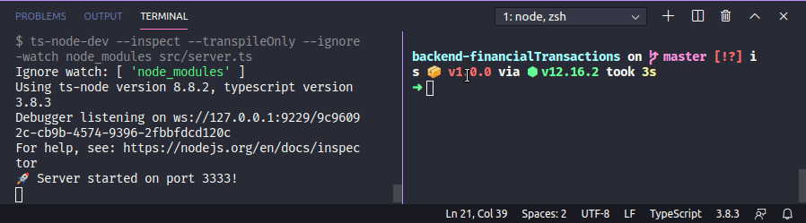

# 🚀 Desafio Back-end com Nodejs

Essa aplicação serve para armazenar transações financeiras de entrada e saída, que deve permitir o cadastro e a listagem dessas transações.

🔹 Foi utilizado Array para manipulação dos dados.

